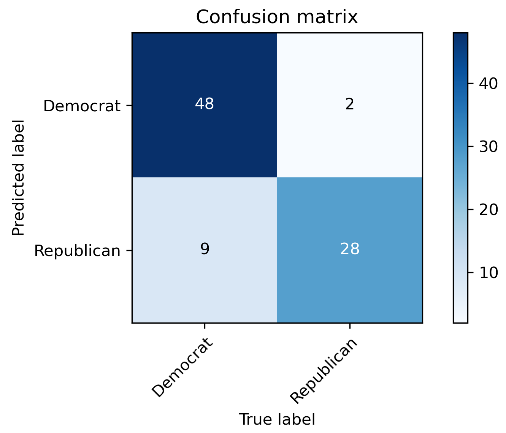
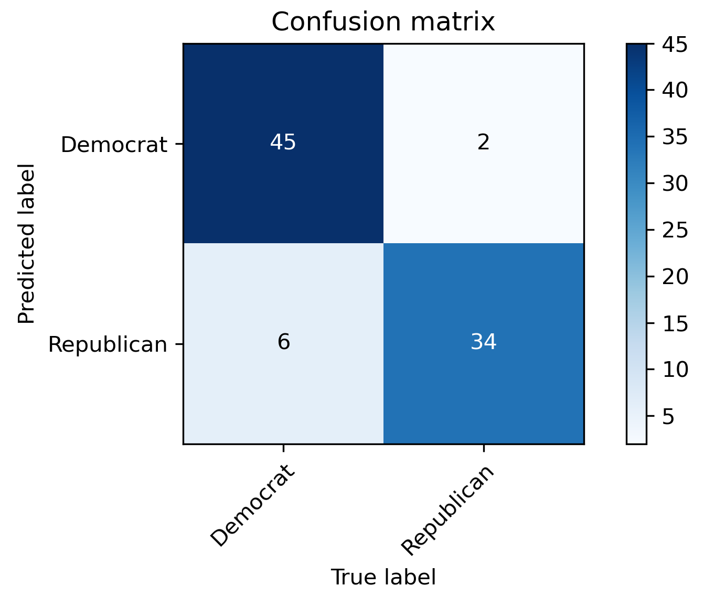

# UE17CS303 - MACHINE LEARNING ASSIGNMENT
##### Applying Naive Bayes classifier to predict voting pattern in a two party electoral system.

## INTRODUCTION
The objective of this project is to apply Naive Bayes classifier on 1984 American election dataset to predict whether a voter is republican or democrat. The dataset has 435 entries each consisting of 16 binary attributes and one target attribute which is also binary in nature. So basically, the dataset has 16⨯435 data points out of which 392 are missing. Since all the attributes are binary, we have converted all ‘yes’ and ‘no’ to ones and zeros. We have also assumed democrat as positive classification and republican as negative.

## DATA CLEANING AND VISUALIZATION
As we have discussed before, our house-votes dataset has 16⨯435 data points out of which 392 are missing and these missing values are distributed over 203 rows and last attribute has about 25% data missing, hence we can’t perform list wise deletion.

Yellow lines in the above figure show the distribution of missing values in all attributes.

So, what we have done is as follows:

We have plotted the distribution of ‘yes’ and ‘no’ for all the 16 attributes across the target attributes: democrat and republican. And now we have used this distribution to impute the missing values.

Suppose the `duty free import` attribute for the second row is missing and the target attribute for that row is democrat. Then we see the distribution of ‘yes’ and ‘no’ in the `duty free import` attribute for all the voters who are democratic. Now whichever attribute value has higher count, we replace the missing value with that attribute value.

The graphs below show the above mentioned distributions:

## IMPLEMENTATION OF NAIVE BAYES CLASSIFIER AND 5-FOLD CROSS VALIDATION
For implementing 5-fold cross validation, we have divided the dataset into 5 bins and in each of the 5 iterations, one bin is used as test-set and remaining four are used as train-set.
[Naive Bayes Classifier](https://en.wikipedia.org/wiki/Naive_Bayes_classifier) is a probabilistic classifier based on Bayes theorem which uses both conditional probability and simple probability and is given by:

    <!-- https://latex.codecogs.com/png.latex?\dpi{400}\normalsize%20P(h|D)=\frac{P(D|h)P(h)}{P(D)} -->
    

    <!-- https://latex.codecogs.com/png.latex?\dpi{400}\normalsize%20P(h|D)\hspace{1mm}=\hspace{1mm}probability\hspace{1mm}of\hspace{1mm}$h$\hspace{1mm}given\hspace{1mm}$D$\hspace{1mm} -->
    

    <!-- https://latex.codecogs.com/png.latex?\dpi{400}\normalsize%20P(D|h)\hspace{1mm}=\hspace{1mm}probability\hspace{1mm}of\hspace{1mm}$D$\hspace{1mm}given\hspace{1mm}$h$\hspace{1mm} -->
    

    <!-- https://latex.codecogs.com/png.latex?\dpi{400}\normalsize%20P(h)\hspace{1mm}=\hspace{1mm}prior\hspace{1mm}probability\hspace{1mm}of\hspace{1mm}hypothesis\hspace{1mm}$h$\hspace{1mm} -->
    

    <!-- https://latex.codecogs.com/png.latex?\dpi{400}\normalsize%20P(D)\hspace{1mm}=\hspace{1mm}prior\hspace{1mm}probability\hspace{1mm}of\hspace{1mm}hypothesis\hspace{1mm}$D$\hspace{1mm} -->
    

Both conditional and simple probability used in the Naïve Bayes classifier above is calculated by following functions:

Since we have 16 input attributes and 1 target attribute and both of them can take binary values, hence the likelihood we will be the multiplication of probability of any 16 combinations out of 64 possible combinations in total. The conditional probability for these 64 combinations is calculated by following code segment (where probability_data is the list storing probability for 64 combinations):

## CONCLUSION AND ITS ANALYSIS
The dataset used for training the Naïve Bayes classifier is randomized in every run, hence the metrics used for measuring the performance has the following range:
1. Accuracy : 91% to 92%
2. Precision : 95% to 96%
3. Recall : 89% to 91%
4. Specificity : 92% to 94%
5. F1 score : 0.92 to 0.93
The following graphs show the metrics for a random run of the code for the first four iterations:

|||
|---|---|
|||

